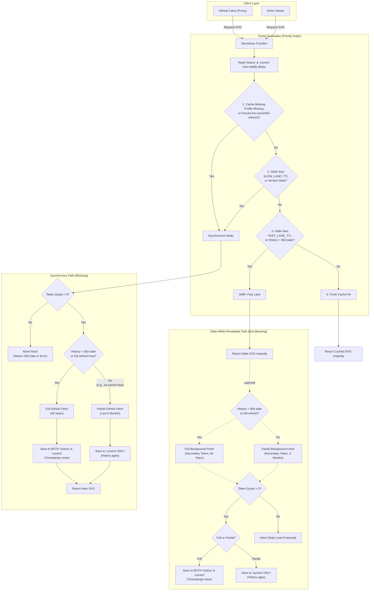

# Caching Behavior and Data Fetching Strategy

This application is designed to be highly responsive and resilient against GitHub API rate limits. To achieve this, it uses a **Stale-While-Revalidate (SWR)** caching pattern combined with environment-configurable Cache-Control headers.

## 1. Stale-While-Revalidate (SWR) Pattern

When a user or a proxy (like GitHub Camo) requests a streak SVG, the application prioritizes speed. 
Instead of making the user wait for a live response from the GitHub API, the application does the following:

1. **Serve Cache:** Immediately returns the locally cached data from the Netlify Blob store (if it exists).
2. **Evaluate Staleness:** Checks if the data has passed its "Stale" threshold (determined by `.env` variables).
3. **Background Fetch:** If the data is stale, the server triggers an asynchronous background process (`waitUntil`) to fetch fresh data from GitHub and update the Blob store. The user *who triggered this fetch* still receives the slightly stale data to ensure their request remains instantaneous.

This pattern prevents "cache stampedes" (thundering herds) where a sudden influx of requests would all trigger expensive, simultaneous GitHub API calls.

## 2. Configuration Variables

The caching behavior is controlled via several variables in your `.env` file:

- **`FAST_LANE_TTL_MINUTES`** (Default: 5)
  The amount of time (in minutes) before the cache is considered stale and a background refresh is permitted using the `GITHUB_TOKEN_SECONDARY`. This ensures rapid updates during active periods without exhausting the primary token limit.

- **`SLOW_LANE_TTL_MINUTES`** (Default: 60)
  The maximum age of the cache before it is considered excessively stale. If the cache is older than this, SWR is bypassed and the server performs a **synchronous fetch** using the primary `GITHUB_TOKEN` to guarantee users never see excessively old data.

- **`CAMO_CACHE_TTL_SECONDS`** (Default: 120)
  The maximum time (in seconds) that an external proxy—specifically GitHub's Camo image proxy—will cache the rendered SVG. This is injected into the `Cache-Control` header (`max-age=X, s-maxage=X`).

## 3. GitHub Camo Interaction Timeline

When a user embeds the SVG on their GitHub README, GitHub routes the image request through its proxy network called Camo. Camo aggressively caches images based on the HTTP headers we provide.

Because of the background fetch architecture, there is a slight, predictable delay before a fresh GitHub contribution appears on the README.

**Example Timeline (The 7-Minute Scenario):**
1. **0:00 - Data is cached:** The app's Blob store has fresh data.
2. **5:00 - Cache becomes stale:** `FAST_LANE_TTL_MINUTES` (5 mins) expires. The application will now fetch new data *on the next request*.
3. **5:01 (User A views README):** GitHub Camo requests the SVG. Because the data is stale, the app **instantly returns the old data** and kicks off a background fetch to get new data. 
4. **5:01 (Camo Caches Old Data):** The app tells Camo to cache this response for `CAMO_CACHE_TTL_SECONDS` (2 minutes).
5. **5:01 (Background Fetch Completes):** Seconds later, the app successfully pulls new data from GitHub and updates the Blob store.
6. **5:01 -> 7:01 (Users B, C, D view README):** Camo serves the *old* image from its own cache. It does not hit the app's server.
7. **7:01 - Camo Cache Expires:** Camo's 2-minute cache expires.
8. **7:02 (User E views README):** Camo requests the SVG from the app. The app sees that its Blob store data is fresh (updated at 5:01) and returns the **new data**. Camo caches and serves the new image.

### Conclusion

The maximum theoretical delay for a GitHub README to show fresh data is:
`FAST_LANE_TTL_MINUTES` + `CAMO_CACHE_TTL_SECONDS` (e.g., 5 mins + 2 mins = **7 minutes**).

This slight "eventual consistency" delay is an intended trade-off that ensures the application never crashes under high load, never gets rate-limited by GitHub, and always serves images in milliseconds.

## 4. Dual-Cache Architecture (Current vs History)

To prevent burning through GitHub's API rate limits on massive user profiles (10+ years of history), the application splits the database into two separate blobs per user:

1. **`{username}:current`**: This holds only the lightweight, recent 6 months of data. The Fast Lane and Slow Lane constantly update this specific file via **Partial Fetches**.
2. **`{username}:history`**: This holds the heavy, historical years of data. When normal SWR partial fetches occur, this file is completely ignored, and its internal `timestamp` slowly ages.

Once the `history` blob's timestamp becomes older than 30 days, the server detects this and forces a **Full Fetch** (recalculating all years from the beginning). This updates both blobs and resets the 30-day timer. This dual-cache design guarantees instant updates for recent activity while lazily maintaining long-term history.

## 5. Flowchart of Cache Logic

Here is a visual representation of the current caching behavior and how the SWR logic is evaluated on every request.

